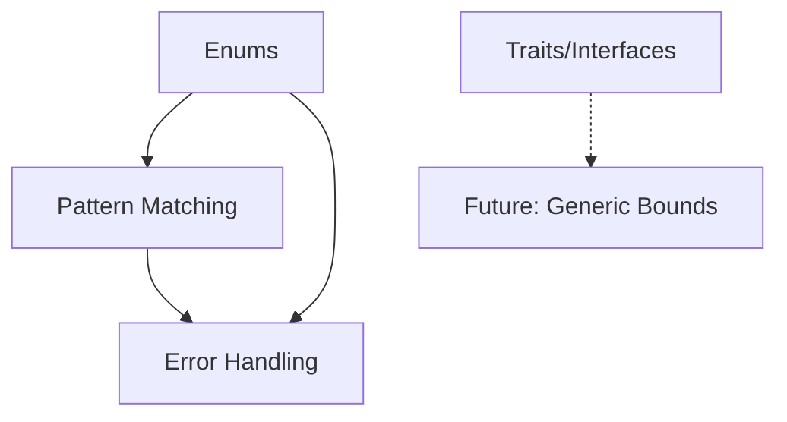

# Phase 12 — Roadmap Proposal

**Status:** PROPOSAL (Awaiting Approval)  
**Document Version:** 1.0.0  
**Date:** 2026-01-16  
**Author:** Quasar Team  
**Depends On:** Phase 11 (FROZEN, v1.8.0)

---

## Executive Summary

Este documento apresenta uma **proposta estruturada** para o Phase 12 do Quasar. Cada feature candidata é apresentada de forma isolada, com escopo definido, justificativa, e estimativa de complexidade.

> [!IMPORTANT]
> **Nenhuma feature está aprovada.** Este documento serve apenas como base para discussão e priorização.

---

## Candidatas para Phase 12

| #   | Feature            | Complexidade | Dependências   | Impacto no Usuário |
| --- | ------------------ | ------------ | -------------- | ------------------ |
| 1   | Enums              | Média        | Nenhuma        | ⭐⭐⭐⭐             |
| 2   | Pattern Matching   | Alta         | Enums (ideal)  | ⭐⭐⭐⭐⭐            |
| 3   | Traits/Interfaces  | Muito Alta   | Structs, OOP   | ⭐⭐⭐               |
| 4   | Error Handling     | Alta         | Enums, Pattern | ⭐⭐⭐⭐             |

---

## Feature 1: Enums

### 1.1 Escopo Isolado

Tipos de dados algébricos simples com variantes nomeadas.

```quasar
enum Color {
    Red,
    Green,
    Blue
}

enum Result[T] {
    Ok(T),
    Err(str)
}

let c: Color = Color.Red
let r: Result[int] = Result.Ok(42)
```

### 1.2 Justificativa

- **Fundação para outras features:** Pattern matching e error handling dependem de enums
- **Baixa complexidade relativa:** Não requer mudanças estruturais no runtime
- **Alto valor imediato:** Elimina "magic strings" e melhora type safety
- **Precedente:** v1.7.0 introduziu Dict, v1.8.0 métodos — enums é a evolução natural

### 1.3 Impacto Técnico

| Componente | Mudanças Necessárias                          |
| ---------- | --------------------------------------------- |
| AST        | `EnumDecl`, `EnumVariant`, `EnumAccessExpr`   |
| Parser     | Nova sintaxe `enum Name { Variant, ... }`     |
| Semantic   | Novo tipo `EnumType`, validação de variantes  |
| CodeGen    | Mapeamento para Python classes ou Enum stdlib |

### 1.4 Estimativa

- **Testes:** ~50-60
- **Duração:** 1-2 semanas
- **Risco:** Baixo

---

## Feature 2: Pattern Matching

### 2.1 Escopo Isolado

Expressões `match` para destructuring e branching baseado em tipo.

```quasar
fn describe(c: Color) -> str {
    match c {
        Color.Red => "vermelho",
        Color.Green => "verde",
        Color.Blue => "azul"
    }
}

fn process(r: Result[int]) -> int {
    match r {
        Result.Ok(value) => value,
        Result.Err(msg) => {
            print("Error: {}", msg)
            return 0
        }
    }
}
```

### 2.2 Justificativa

- **Expressividade:** Substitui cascatas de `if/else`
- **Type exhaustiveness:** Compilador valida que todos os casos são cobertos
- **Modernidade:** Feature presente em Rust, Swift, Kotlin
- **Sinergia:** Maximiza valor de Enums quando combinados

### 2.3 Impacto Técnico

| Componente | Mudanças Necessárias                               |
| ---------- | -------------------------------------------------- |
| AST        | `MatchExpr`, `MatchArm`, `Pattern`                 |
| Parser     | Sintaxe `match expr { pattern => body, ... }`      |
| Semantic   | Exhaustiveness checking, pattern type validation   |
| CodeGen    | Mapeamento para if/elif chains ou match (Py 3.10+) |

### 2.4 Estimativa

- **Testes:** ~70-90
- **Duração:** 2-3 semanas
- **Risco:** Médio (exhaustiveness check é complexo)
- **Dependência Recomendada:** Enums (para valor máximo)

---

## Feature 3: Traits/Interfaces

### 3.1 Escopo Isolado

Contratos de comportamento que structs podem implementar.

```quasar
trait Printable {
    fn to_string(self) -> str
}

struct Point {
    x: int
    y: int
}

impl Printable for Point {
    fn to_string(self) -> str {
        return "({}, {})".format(self.x, self.y)
    }
}

fn display(p: Printable) -> void {
    print(p.to_string())
}
```

### 3.2 Justificativa

- **Polimorfismo:** Permite código genérico sobre comportamentos
- **Extensibilidade:** Adiciona comportamento a structs sem herança
- **Design moderno:** Composição sobre herança (Rust/Go style)

### 3.3 Impacto Técnico

| Componente | Mudanças Necessárias                            |
| ---------- | ----------------------------------------------- |
| AST        | `TraitDecl`, `ImplBlock`, método `self`         |
| Parser     | Sintaxe `trait`, `impl Trait for Struct`        |
| Semantic   | Trait bounds, method resolution, vtable virtual |
| CodeGen    | Mapeamento para Python duck typing ou protocols |

### 3.4 Estimativa

- **Testes:** ~100-120
- **Duração:** 3-4 semanas
- **Risco:** Alto (mudança arquitetural significativa)
- **Impacto na Especificação:** Requer introdução de `self`, discussão sobre `void`

> [!WARNING]
> Esta feature requer revisão das decisões FROZEN sobre tipos (ausência de `void`) e introduz novo keyword `self`.

---

## Feature 4: Error Handling (Result Types)

### 4.1 Escopo Isolado

Tipos `Result<T, E>` para tratamento de erros sem exceções.

```quasar
fn divide(a: int, b: int) -> Result[int, str] {
    if b == 0 {
        return Result.Err("division by zero")
    }
    return Result.Ok(a / b)
}

fn main() -> int {
    let r: Result[int, str] = divide(10, 2)
    match r {
        Result.Ok(v) => print("Result: {}", v),
        Result.Err(e) => print("Error: {}", e)
    }
    return 0
}
```

### 4.2 Justificativa

- **Safety:** Força tratamento explícito de erros
- **Clareza:** Erros são parte do contrato da função
- **Composição:** Funções podem propagar erros de forma type-safe

### 4.3 Impacto Técnico

| Componente | Mudanças Necessárias                        |
| ---------- | ------------------------------------------- |
| AST        | `Result[T, E]` como tipo genérico           |
| Parser     | Sintaxe de tipo parametrizado               |
| Semantic   | Validação de tipos genéricos com 2 params   |
| CodeGen    | Mapeamento para tuplas ou classes Python    |

### 4.4 Estimativa

- **Testes:** ~40-50
- **Duração:** 1-2 semanas
- **Risco:** Baixo (se Enums + Pattern já existirem)
- **Dependência Forte:** Enums e Pattern Matching

> [!CAUTION]
> Implementar Error Handling sem Enums e Pattern Matching reduz drasticamente sua usabilidade.

---

## Análise de Dependências



**Legenda:**
- `-->` Dependência forte (feature anterior aumenta valor significativamente)
- `-.->` Dependência futura (abre portas para features v1.10+)

---

## Recomendação de Priorização

### Opção A: Prioridade Funcional (Recomendada)

| v1.9.0 | v1.10.0 | v1.11.0 | Futuro  |
| ------ | ------- | ------- | ------- |
| Enums  | Pattern | Error   | Traits  |

**Justificativa:**
- Enums são fundação para Pattern e Error
- Pattern Matching é a feature mais impactante combinada com Enums
- Error Handling fecha o ciclo de safety
- Traits pode ser adiado (maior complexidade, menor urgência)

### Opção B: Incremento Mínimo

| v1.9.0 | v1.10.0         |
| ------ | --------------- |
| Enums  | Decisão futura  |

**Justificativa:**
- Menor risco
- Permite avaliar adoção de Enums antes de decidir próximos passos

### Opção C: Máxima Expressividade

| v1.9.0          |
| --------------- |
| Enums + Pattern |

**Justificativa:**
- Combina as duas features mais solicitadas
- Entrega valor completo de uma vez
- Maior esforço, mas maior impacto

---

## Próximos Passos Propostos

1. **Escolher UMA feature** para Phase 12.1 (recomendação: Enums)
2. **Criar documento PHASE12_DESIGN.md** com especificação detalhada
3. **Freeze do design** após aprovação
4. **Implementação** seguindo metodologia TDD existente
5. **Release v1.9.0** após validação completa

---

## Decisão Requerida

> [!IMPORTANT]
> Aguardando aprovação para prosseguir com design detalhado de UMA das opções:
> - [ ] Opção A: Enums primeiro, depois Pattern, depois Error
> - [ ] Opção B: Apenas Enums, reavaliação após
> - [ ] Opção C: Enums + Pattern juntos
> - [ ] Outra priorização

---

**Este documento é uma proposta. Nenhuma implementação será iniciada sem aprovação explícita.**
